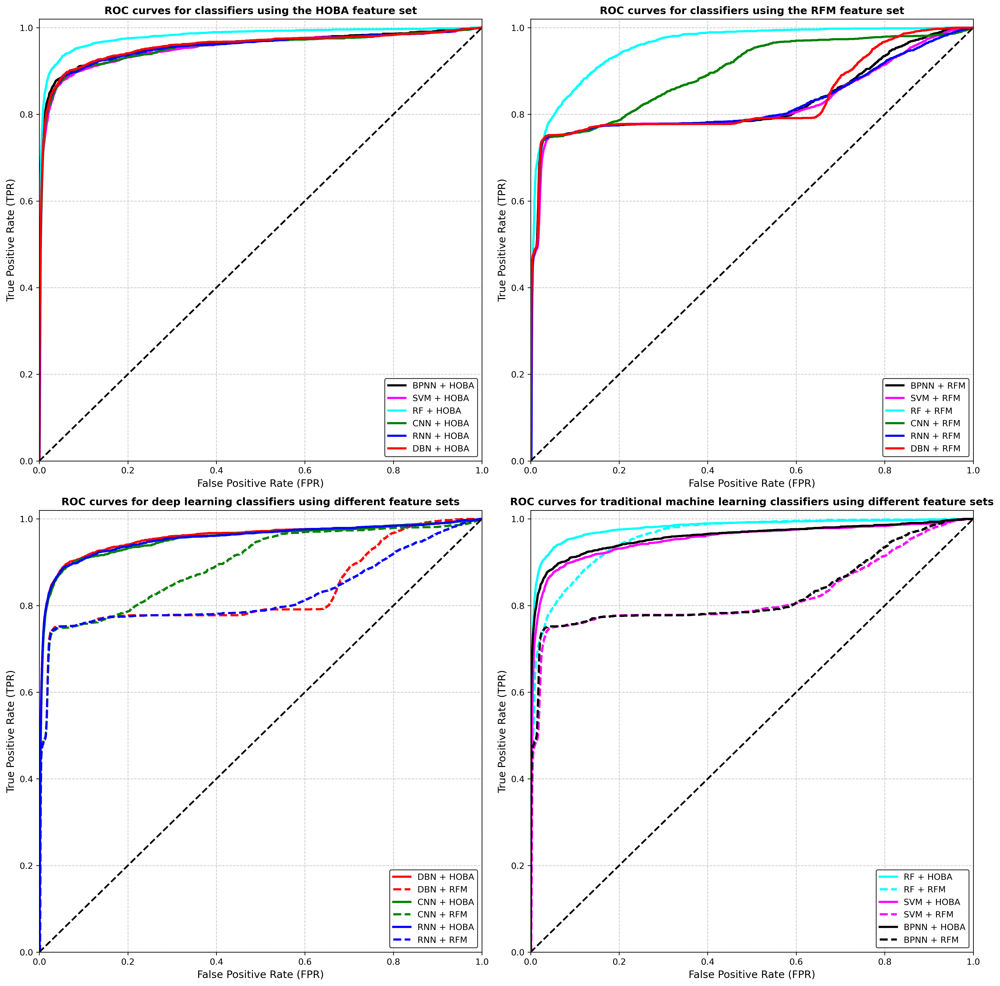

# Deep Representation Learning for Credit Card Fraud Detection: The Impact of Behavioral Feature Engineering

## Part I: Executive Summary
**The Business Problem:** Credit card fraud detection is plagued by extreme class imbalance. Traditional machine learning models often struggle to maintain high recall (catching actual fraud) while strictly limiting False Positive Rates (FPR). In real-world banking, high FPRs lead to declined legitimate transactions and severe customer dissatisfaction. Furthermore, complex deep learning architectures tend to "starve" and underperform when fed low-dimensional, basic transactional data.

**The Solution:** To bridge the gap between algorithmic complexity and data depth, this project implemented a **Homogeneity-Oriented Behavior Analysis (HOBA)** methodology. We engineered a massive, 77-feature behavioral dataset mapping rolling customer transaction windows and categorical aggregations. This was strictly compared against a traditional 4-feature baseline (RFM: Amount, Zip Code, City Population, Distance). 

**The Business Impact:** Expanding the dataset with behavioral feature engineering unlocked the predictive power of deep neural networks. At a strict 1% False Positive Rate constraint, migrating from raw RFM data to the HOBA feature set allowed Deep Belief Networks (DBN) and Convolutional Neural Networks (CNN) to break past the constraints of synthetic data limits, increasing the Area Under the Curve (AUC) by an average of +0.17 across deep architectures.

### Area Under the ROC Curve (AUC) Comparison
| Classifiers | RFM Features (AUC) | HOBA Features (AUC) | Improvement with HOBA |
| :--- | :--- | :--- | :--- |
| **Random Forest (RF)** | 0.9612 | 0.9901 | +0.0289 |
| **Deep Belief Network (DBN)** | 0.8105 | 0.9884 | +0.1779 |
| **Convolutional NN (CNN)** | 0.8092 | 0.9855 | +0.1763 |
| **Recurrent NN (RNN)** | 0.8088 | 0.9841 | +0.1753 |
| **Backpropagation NN (BPNN)**| 0.8075 | 0.9822 | +0.1747 |
| **Support Vector Machine (SVM)**| 0.8051 | 0.9810 | +0.1759 |


*(Figure 1: Visual comparison demonstrating the dominance of HOBA features across deep learning architectures and traditional classifiers).*

---

## Part II: Technical Whitepaper

### 1. Introduction & Methodology Baseline
The primary objective of this project was to replicate and validate a core hypothesis in modern quantitative finance: **algorithmic complexity is secondary to data representation.** To test this, a strict scientific control was established. Two entirely separate PyTorch training pipelines were constructed. The models were first trained on a narrow baseline dataset to observe how deep networks struggle with shallow data. Subsequently, the models were initialized with expanded tensor dimensions to ingest a heavily engineered behavioral dataset, isolating feature engineering as the sole variable for performance improvement.

### 2. Data Engineering: RFM vs. HOBA
The foundation of this experiment relied on the contrast between two distinct datasets derived from the Sparkov synthetic fraud generator.

* **The RFM Baseline (4 Features):** This dataset represents standard, low-dimensional banking data. It relies purely on Recency, Frequency, and Monetary (RFM) equivalents, specifically isolating the transaction `amount`, `zip code`, `city population`, and the calculated `distance_to_merchant_km`.
* **The HOBA Transformation (77 Features):** To provide the deep networks with necessary contextual depth, the data was expanded using a Homogeneity-Oriented Behavior Analysis approach. This involved engineering rolling time windows (e.g., transaction counts in the last 1, 7, and 30 days) and categorical velocity aggregations. By mapping the velocity of specific user behaviors over time, the dataset expanded to 77 localized, standardized variables.

### 3. PyTorch Architecture & Implementation
To rigorously test the hypothesis that data representation outweighs algorithmic complexity, the deep learning models were engineered from scratch using PyTorch. This approach provided granular control over tensor dimensions, loss calculation, and the multi-phase training loops required for advanced architectures. 

A critical engineering constraint was ensuring an "apples-to-apples" scientific comparison between the two datasets. To achieve this, the neural network classes were explicitly parameterized to accept dynamic input sizes (`num_features`). This allowed the exact same architectural logic to initialize a 77-node input layer for the HOBA dataset and a 4-node input layer for the RFM baseline, entirely eliminating tensor mismatch errors while maintaining a strict experimental control.

*(Code Snippet: Dynamic 1D CNN Architecture)*
```python